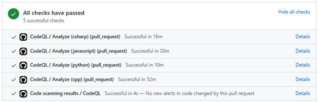

# SDLC Development Phase Documentation 

## Process steps: *(Images provide an example process)*
*The process is considered complete once it reaches the Feature level. Developers will continuously run this process for all PBIs until each one is completed under its designated feature. Afterward, they will execute the process one final time at the Feature level, obtain approval for their PR from the security lead, and then transition to the next Feature, or from the Development Phase to the Testing Phase.*

### 1. Develop code

**a.	Entry point for this can be from two places:**

        i.	Developing code from initial requirement gathering and threat modeling.

        ii. Feedback from stakeholders required reworking of requirements and/or threat model and a new Feature was made to address this feedback.

### 2. Create pull request

### 3. CodeQL SAST scan runs automatically

### 4. Check results of CodeQL (They will appear in the PR)

### 5. If no new vulnerabilities, close PR (if at Feature level, Security lead approval required)

### 6. If new vulnerability:

**a. Check to find bug in backlog:**

        i.	Feature for CodeQL bugs for each team will be named (per the template):

            a. “[TEAM NAME] CodeQL Bugs (SAST Implementation)”

**b. Move bug to appropriate Feature and change the Iteration path**

**c. Decide to resolve or backlog bug**

    1. If resolve, fix vulnerability

        a. Chose to use Copilot Autofix solution in photo example

    2. If dismiss, chose option from dropdown menu as to why and include comment explaining dismissal

**d. Document results in bug on how the vulnerability was fixed or why you chose to backlog and change bug state to “Done”**

    i. Two options to fill in Repro Steps:

        1. “Fixed: (explain how you fixed the bug)”

        2. “Ignored: (explain why you chose to ignore the bug)”

### 7.	Complete step 6(a-d) until all vulnerabilities found in this PR are resolved

    a. If the vulnerabilities found in this PR inspire a rework of the threat model or requirements, please return to the requirements and design phases to do so.

### 8. Check to make sure all CodeQL checks passed for this PR (no more new vulnerabilities)

### 9. Link the PR to the PBI/Feature in backlog

### 10. Close PR. If Feature, Security Lead must approve the PR before it can be closed.
 
 
 
 

 ---

 
 
 
 

# Checklist:

### For each new vulnerability:

- [ ] The new vulnerability has been resolved or dismissed.
- [ ] There is documentation in the bug associated with the vulnerability on Azure Devops backlog on how the vulnerability was fixed or why you chose to dismiss it.
  - Following the template:

    -	Fixed: (explain how you fixed the bug)
    -	Dismissed: (explain why you chose to dismiss the bug)
- [ ] The bug state was changed to “done”
    
 

### Once all new vulnerabilities are resolved:
- [ ] All CodeQL checks have passed for the PR
- [ ] The PR was added as a link in the PBI/Feature it is associated with.
- [ ] The PR was approved by the security lead <mark>(only at the Feature level, for PBIs this step does not need to be completed) </mark>
- [ ] The PR was closed
