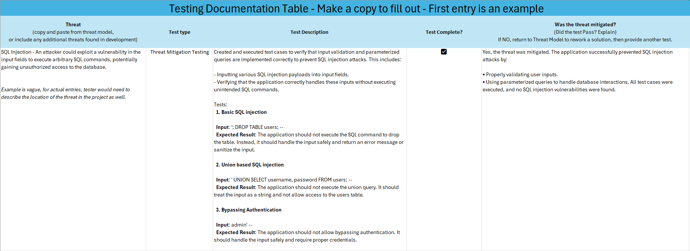

# SDLC Development Phase Documentation
*All tests are to be completed by independent Security Tester role. For each threat identified by the threat model, there must be a test to ensure the threat was mitigated.  Complete the table below for each threat.*

## Types of Testing
*Each test will be labeled as <mark>Low</mark>, <mark>Medium</mark>, or <mark>High</mark> risk. This is in reference to the risk level of the Feature/PBI. If suitable, please use the tests corresponding to the risk level of the Feature/PBI.*

*Low and Medium risk tests can also be used for High risks cases, but a High risk test MUST be used as well.* 

 

### 1. Threat Mitigation Testing     *<mark>Low</mark>*
This type of testing focuses on verifying that the mitigations for identified threats from the threat model are effective. 
*For example, you would use this type of testing when you want to test that you successfully avoided a predicted threat.*

**Activities:**
- **Creating and Executing Test Plans:** Develop specific test cases for each threat mitigation. 
    - *Ex: Develop a test case to verify SQL injection mitigation. For example, attempt to insert SQL commands into input fields and check if they are blocked.*
- **Simulating Attacks:** Attempt to bypass the mitigations using various attack techniques. This helps ensure that the mitigations are robust and can withstand real-world attacks.
    - *Ex: Use tools like SQLMap to simulate SQL injection attacks and ensure the mitigation is effective.*

### 2. Abuse Case Testing     *<mark>Low</mark>*
This involves testing the system with scenarios that mimic potential abuse by an attacker. Misuse and abuse cases describe how users misuse or exploit the weaknesses of controls in software features to attack an application.  
*For example, you would use this type of testing when adding a new user input field to a form.*

**Activities:**
- **Manual or Automated Testing:** Use both manual and automated tools to test for abuse cases.
    - *Ex: To counteract potential abuse of user input fields, perform fuzz testing to send malformed inputs and observe how the system handles them.*
- **Testing External Interfaces:** Focus on all external interfaces and protocols to ensure they are secure against abuse.
    - *Ex: Test the security of APIs by sending unexpected or malicious requests to ensure they handle abuse gracefully.*

    
### 3. Boundary Testing     *<mark>Medium</mark>*
Boundary testing involves testing the limits of the system by inputting values at the edge of the allowed input range.  
*For example, you would use this type of testing when setting up a new input field that accepts values between X and X.*

**Activities:**
- **Identifying Boundary Values:** Determine the minimum and maximum values for input fields and other parameters.
    - *Ex: For a field that accepts ages 1 to 100, test with values 0, 1, 100, and 101 to ensure the system handles these edge cases correctly.*
- **Testing Edge Cases:** Input values at, just below, and just above the boundary limits to check for proper handling.
    - *Ex: For a text field with a maximum length of 255 characters, test with 254, 255, and 256 characters to ensure the system behaves as expected.*

### 4. Penetration Testing     *<mark>High</mark>*
Penetration testing involves simulating attacks on the system to identify and exploit vulnerabilities. 
*For example, you would use this type of testing when deploying a new authentication system.*

**Activities:**
- **Comprehensive Attack Simulation:** Perform tests that mimic an attacker’s approach, such as attempting to gain unauthorized access, escalate privileges, or exfiltrate data.
    - *Ex: Simulate an attack by attempting to gain unauthorized access to the system using techniques like password cracking or exploiting known vulnerabilities.*
- **Chaining Vulnerabilities:** Test for the possibility of exploiting multiple vulnerabilities in a sequence to achieve a more significant impact.
    - *Ex: Identify and exploit multiple vulnerabilities in sequence, such as using a weak password to gain access and then escalating privileges to an admin level.*

### 5. Dynamic Analysis     *<mark>High</mark>*
Dynamic analysis involves testing the system in a running state to identify vulnerabilities that are not visible in static code analysis. 
*For example, you would use this type of testing when releasing a new version of the application.*

**Activities:**
- **Runtime Testing:** Test for issues like memory leaks, race conditions, and unauthorized access to shared resources.
    - *Ex: Use tools like Valgrind to detect memory leaks and race conditions while the application is running.*
- **Resource Management Testing:** Ensure that the system manages resources correctly under various conditions, such as high load or unexpected input.
    - *Ex: Test how the system handles high load conditions by simulating a large number of concurrent users and checking for resource exhaustion.*

### 6. Attack Surface Analysis     *<mark>High</mark>*
This involves identifying all possible entry and exit points in the system and testing them for vulnerabilities. 
*For example, you would use this type of testing when exposing new APIs to external clients.*

**Activities:**
- **Mapping Entry and Exit Points:** Create a detailed map of all network ports, services, and interfaces.
    - *Ex: Use a tool like Nmap.*
- **Testing for Common Vulnerabilities:** Test for common issues like weak access control lists (ACLs), exposed ports, and services running with elevated privileges.
    - *Ex: Check for weak access control lists (ACLs) and exposed ports using vulnerability scanners like Nessus.*

### 7. Vulnerability Scanning     *<mark>High</mark>*
This involves using automated tools to scan the system for known vulnerabilities. 
*For example, you would use this type of testing when integrating third-party libraries into the application.*

**Activities:**
- **Black Box Scanning:** Use network-based vulnerability scanners to detect known issues in the system’s hardware, host, or software components.
    - *Ex: Use a network-based vulnerability scanner like OpenVAS to detect known issues in the system’s hardware and software components.*
- **Software Composition Analysis:** Analyze compiled software to detect known vulnerabilities, linking to vulnerable libraries, and security rule violations.
    - *Ex: Analyze compiled software with tools like OWASP Dependency-Check to detect known vulnerabilities in linked libraries.*

### 8. Functional and Performance Testing     *<mark>High</mark>*
Ensure that security features function correctly and perform well under various conditions. 
*For example, you would use this type of testing when implementing a new security feature like two-factor authentication.*

**Activities:**
- **Functional Testing:** Verify that each security feature works as intended. For example, test that authentication mechanisms prevent unauthorized access.
    - *Ex: Verify that authentication mechanisms prevent unauthorized access by attempting to log in with incorrect credentials.*
- **Performance Testing:** Assess the performance of security features under different loads to ensure they do not degrade the system’s overall performance.
    - *Ex: Assess the performance of security features under different loads using tools like JMeter to ensure they do not degrade the system’s overall performance.*

## Example: Reading a HTML file
*Here are some examples of abuse test cases and malformed inputs you can use to test the robustness of your code when reading an HTML file.*

1. **HTML Injection:**
    - **Test:** Insert `` into the HTML file.
    - **Purpose:** Check if the application executes the script, indicating a vulnerability to XSS attacks.
2. Malformed HTML Tags:
    - **Test:** Use `
`Unclosed div in the HTML file.
    - **Purpose:** Verify how the application handles unclosed tags. It should not crash or behave unexpectedly.
3. Special Characters and Encodings:
    - **Test:** Include `&lt;script&gt;alert('XSS')&lt;/script&gt;` in the HTML file.
    - **Purpose:** Ensure the application correctly decodes HTML entities and does not execute them as scripts.
4. Large Input Size:
    - **Test:** Create a very large HTML file with repetitive content.
    - **Purpose:** Test for buffer overflow or memory issues. The application should handle large files gracefully without crashing.
5. Invalid Nested Tags:
    - **Test:** Use `

` in the HTML file.
    - **Purpose:** Check if the application can handle improperly nested tags without errors.
6. Broken Attributes:
    - **Test:** Include `` in the HTML file.
    - **Purpose:** Verify how the application handles attributes with unescaped quotes. It should not break the HTML structure.
7. CSS Injection:
    - **Test:** Insert `` into the HTML file.
    - **Purpose:** Ensure the application does not allow unauthorized CSS changes that could affect the user interface.
8. Mixed Content:
    - **Test:** Use `
Text  More text
` in the HTML file.
    - **Purpose:** Check if the application can handle mixed content without executing scripts.

## COMPLETE THIS TABLE (First entry is an example)
### [Link to table ](https://caterpillar-my.sharepoint.com/:x:/g/personal/hannah_ghassemian_solarturbines_com/Ec9JIJd6wsBFp1FugjO6oKMBut2JGJiHeTCTGG1-vvwa5A?e=6J7fCH)
